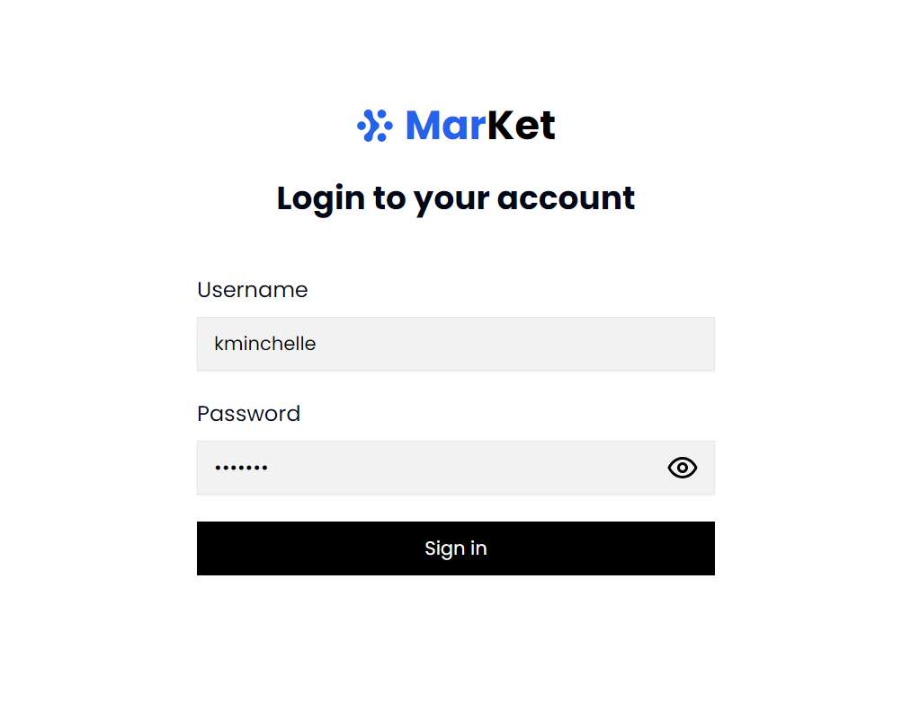
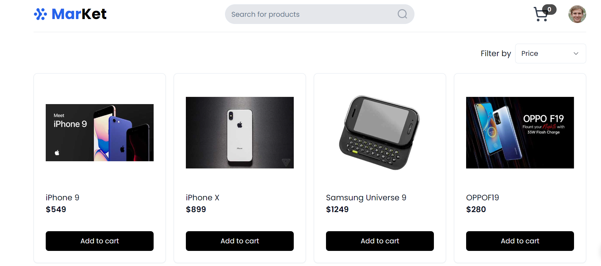

<div align="center">


<br/>

# MarKet

[Live Website](https://market-tcm.vercel.app/)

</div>

## Preview





## Create Project

```bash
pnpm create vite@latest innovation-assignment -- --template react
```

## Install Tailwind

```bash
pnpm add -D tailwindcss postcss autoprefixer

pnpx tailwindcss init -p
```

## ShadcnUi with Javascript

### Step 1

- create a `jsconfig.json` file in root.

### Step 2

```javascript
{"compilerOptions": {"baseUrl": ".", "paths": {"@/*": ["./src/*"]}}}
```

### Step 3

- Setup `vite.config.js`

### Step 4

```javascript
import path from "path";
import {dirname} from "path";
import {fileURLToPath} from "url";
import react from "@vitejs/plugin-react";
import {defineConfig} from "vite";

const __dirname = dirname(fileURLToPath(import.meta.url));

export default defineConfig({
  plugins: [react()],
  resolve: {
    alias: {
      "@": path.resolve(__dirname, "./src"),
    },
  },
});
```

### Step 5

- Install `shadcnui` with the CLI command

### Step 6

- Follow this `components.json` to answer questions

```json
{
  "$schema": "https://ui.shadcn.com/schema.json",
  "style": "default",
  "rsc": false,
  "tsx": false,
  "tailwind": {
    "config": "tailwind.config.js",
    "css": "src/index.css",
    "baseColor": "slate",
    "cssVariables": true,
    "prefix": ""
  },
  "aliases": {
    "components": "@/components",
    "utils": "@/lib/utils"
  }
}
```
